ainsel weather
================
Ainsel Levitskaia-Collins, HL2710
2025-11-18

### Initial Setup

Importing Data:

``` r
shooting_h <- read_csv("./Data Folder/Shooting_Historic.csv") %>% 
  janitor::clean_names()

shooting_2025 <- read_csv("./Data Folder/Shooting_2025.csv") %>% 
  janitor::clean_names() %>% 
  mutate(statistical_murder_flag = case_match(statistical_murder_flag,
                                             "N" ~ FALSE,
                                             "Y" ~ TRUE))

weather <- read_csv("./Data Folder/Weather.csv") %>% 
  janitor::clean_names()

holidays <- readxl::read_excel("./Data Folder/Holidays.xlsx")
```

Merge & tidy shooting data:

``` r
shooting <- bind_rows(shooting_2025, shooting_h) %>% 
  separate_wider_delim(occur_date, delim = "/", names_sep = ".") %>% 
  rename(
    month = occur_date.1,
    day = occur_date.2,
    year = occur_date.3,
    time = occur_time
  ) %>% 
  mutate(
    month = case_match(month,
      "01" ~ "January",
      "02" ~ "February",
      "03" ~ "March",
      "04" ~ "April",
      "05" ~ "May",
      "06" ~ "June",
      "07" ~ "July",
      "08" ~ "August",
      "09" ~ "September",
      "10" ~ "October",
      "11" ~ "November",
      "12" ~ "December"),
    day = as.numeric(day),
    year = as.numeric(year)) %>% 
  distinct(incident_key, .keep_all = TRUE) %>% 
  filter(boro == "MANHATTAN")
```

### Weather Analysis

Tidy weather data:

``` r
weather <- weather %>% 
  separate_wider_delim(date, delim = "-", names_sep = "_") %>% 
  rename(
    year = date_1,
    month = date_2,
    day = date_3
  ) %>% 
  mutate(
    month = case_match(month,
      "01" ~ "January",
      "02" ~ "February",
      "03" ~ "March",
      "04" ~ "April",
      "05" ~ "May",
      "06" ~ "June",
      "07" ~ "July",
      "08" ~ "August",
      "09" ~ "September",
      "10" ~ "October",
      "11" ~ "November",
      "12" ~ "December"),
    day = as.numeric(day),
    year = as.numeric(year)) %>% 
  filter(year >= 2006) %>% 
  select(name, month, day, year, prcp, prcp_attributes, tmax, tmin, latitude, longitude)
```

Merge with shooting data:

``` r
# OBSOLETE?
# shooting_weather <- full_join(shooting, weather, by = c("month", "day", "year")) %>% 
  # mutate(
    # shooting = incident_key > 0,
    # shooting = case_match(shooting,
                          # TRUE ~ "Incident",
                          # NA ~ "No Incident")
  # )

weather_shooting <- left_join(weather, shooting, by = c("month", "day", "year")) %>% 
  group_by(year, month, day) %>% 
  slice_head() %>% 
  ungroup() %>% 
  mutate(
    shooting = incident_key > 0,
    shooting = case_match(shooting,
                          TRUE ~ "Incident",
                          NA ~ "No Incident")
  )
```

Plot of max/min temperature and whether there was a shooting:

``` r
plot_temp_shoot_hist <- weather_shooting %>% 
  drop_na(incident_key) %>% 
  mutate(tmax = tmax / 10) %>% 
  ggplot(aes(x = tmax)) +
  geom_histogram(fill = "violetred4") +
  theme_minimal() +
  xlab("Maximum daily temperature (C)") +
  ylab("Total shooting count") +
  ggtitle("Histogram of total shooting count compared to maximum daily temperature")

plot_temp_shoot_hist
```

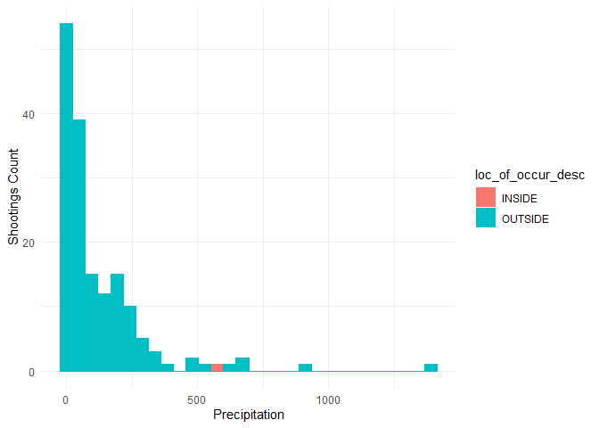<!-- -->

#### TEST compare to the monthly chart, run a test idk

Plot of precipitation and whether there was a shooting:

``` r
plot_prcp_low_shooting <- weather_shooting %>% 
  filter(prcp < 400) %>% 
  ggplot(aes(x = prcp, color = shooting, fill = shooting)) + 
  geom_histogram() +
  scale_color_manual(values = c("violetred4", "lightsteelblue3")) +
  scale_fill_manual(values = c("violetred4", "lightsteelblue3")) +
  theme_minimal() +
  xlab("Precipitation (tenths of mm)") +
  ylab("") +
  ggtitle("HIstogram of shooting count in low precipitation")

plot_prcp_low_shooting
```

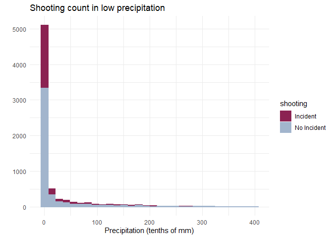<!-- -->

``` r
plot_prcp_high_shooting <- weather_shooting %>% 
  filter(prcp > 400) %>% 
  ggplot(aes(x = prcp, color = shooting, fill = shooting)) + 
  geom_histogram() +
  scale_color_manual(values = c("violetred4", "lightsteelblue3")) +
  scale_fill_manual(values = c("violetred4", "lightsteelblue3")) +
  theme_minimal() +
  ylab("") +
  xlab("Precipitation (tenths of mm)") +
  ggtitle("Histogram of shooting count in high precipitation")

plot_prcp_high_shooting
```

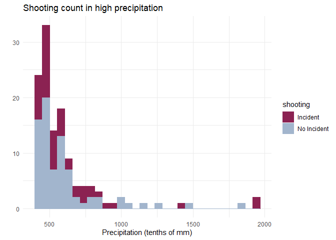<!-- -->

There appears to be a higher quantity of shootings during
lower-precipitation days, however it’s difficult to tell whether this is
correlative or not.

Plot of yes/no precipitation:

``` r
plot_prcp_yesno <- weather_shooting %>% 
  mutate(any_prcp = prcp > 0,
         any_prcp = case_match(any_prcp,
                               TRUE ~ "Precipitation",
                               FALSE ~ "No Precipitation")) %>% 
  ggplot(aes(x = any_prcp, fill = shooting)) +
  geom_bar(position = position_dodge()) +
  theme_minimal() +
  scale_fill_manual(values = c("violetred4", "lightsteelblue3")) +
  xlab("") +
  ylab("Total Number of Days") +
  ggtitle("Bar plot of shooting incidence in no precipitation vs precipitation")

plot_prcp_yesno
```

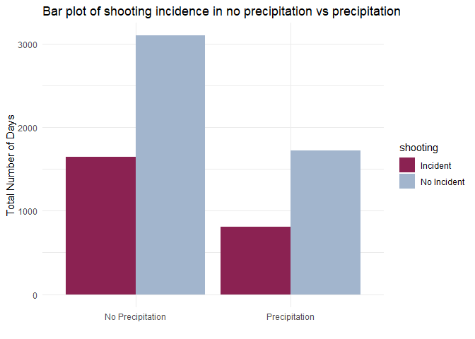<!-- -->

After converting precipitation to a binary variable, there does not
appear to be any visible association between whether there was a
shooting & whether there was any precipitation that day.

#### TEST ttest to confirm lack of association

### Holiday Analysis

Tidy holiday data:

``` r
holidays <- holidays %>% 
  pivot_longer(`2025`:`2006`, names_to = "year", values_to = "date") %>% 
  separate_wider_delim(date, delim = "/", names_sep = "_") %>% 
  rename(
    month = date_1,
    day = date_2
  ) %>% 
  mutate(
    month = case_match(month,
      "1" ~ "January",
      "2" ~ "February",
      "3" ~ "March",
      "4" ~ "April",
      "5" ~ "May",
      "6" ~ "June",
      "7" ~ "July",
      "8" ~ "August",
      "9" ~ "September",
      "10" ~ "October",
      "11" ~ "November",
      "12" ~ "December"),
    day = as.numeric(day),
    year = as.numeric(year))
```

Merge with shooting data:

``` r
holiday_shooting <- left_join(weather, holidays, by = c("month", "day", "year")) %>% 
  select(month, day, year, holiday) %>% 
  mutate(holiday = replace_na(holiday, "No Holiday"))

holiday_shooting <- left_join(holiday_shooting, shooting, by = c("month", "day", "year")) %>% 
  group_by(year, month, day) %>% 
  slice_head() %>% 
  ungroup() %>% 
  mutate(
    shooting = incident_key > 0,
    shooting = case_match(shooting,
                          TRUE ~ "Incident",
                          NA ~ "No Incident"),
    holiday_yn = holiday != "No Holiday",
    holiday_yn = case_match(holiday_yn,
                            FALSE ~ "No Holiday",
                            TRUE ~ "Holiday")
  )
```

Plot of yes vs no holiday:

``` r
plot_holiday_yn <- holiday_shooting %>% 
  ggplot(aes(x = holiday_yn, fill = shooting)) +
  geom_bar(position = position_dodge()) +
  theme_minimal() +
  scale_fill_manual(values = c("violetred4", "lightsteelblue3")) +
  xlab("") +
  ylab("Total Number of Days") +
  ggtitle("Bar plot of shooting incidence on a federal holiday vs no holiday")

plot_holiday_yn
```

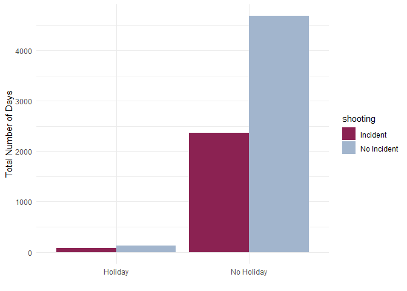<!-- -->

Plot of individual holidays vs no holiday:

#### TODO fix order of holiday variables (factor?)

``` r
plot_holiday_i <- holiday_shooting %>% 
  filter(holiday != "No Holiday") %>% 
  drop_na(incident_key) %>% 
  filter(holiday != "Juneteenth") %>% 
  ggplot(aes(x = holiday, fill = shooting)) +
  geom_bar(position = position_dodge(), width = 0.8) +
  theme_minimal() +
  theme(axis.text.x = element_text(angle = 90, vjust = 0.5, hjust=1)) +
  scale_fill_manual(values = c("violetred4", "lightsteelblue3")) +
  xlab("") +
  ylab("Total number of days")

plot_holiday_i
```

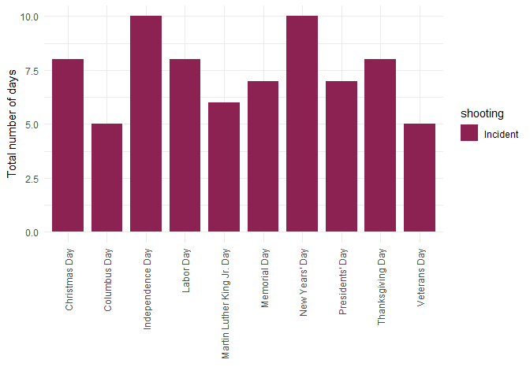<!-- -->

It seems that there’s a trend of more shootings happening on non-holiday
days than on holiday days. Will need to do further testing to confirm
whether this is a significant association.

#### TEST test the significance of this, ttest for yes/no holiday, unsure for other holidays. linear regression, probably?

#### TODO holiday shootings / holiday *vs* not holiday shootings / not holiday (ex num/10 vs num/355) to compare ratios/averages

### COVID Analysis

Plot of per-year shooting incidence:

``` r
plot_covid_yearly <- shooting %>% 
  ggplot(aes(x = year)) +
  geom_histogram(bins = 19, color = "violetred4", fill = "violetred4") +
  theme_minimal() +
  ylab("Number of Shootings") +
  xlab("Year")

plot_covid_yearly
```

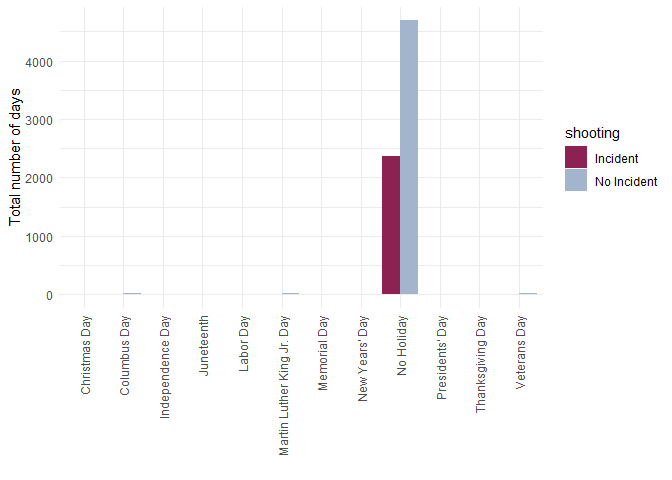<!-- -->

There appears to be a decrease leading to 2020, and then a spike at
2020.

Create variable for whether or not shooting takes place during COVID-19
pandemic :

- Based on WHO dates for when the pandemic began and ended:
  - March 11, 2020: start of pandemic
  - May 5, 2023: end of pandemic

``` r
# march 11 2020: declared pandemic by WHO
# may 5 2023: end of pandemic declared by WHO

pandemic_shooting <- left_join(weather, shooting, by = c("month", "day", "year")) %>% 
  select(-c(name, prcp, prcp_attributes, tmax, tmin, latitude.x, longitude.x)) %>% 
  group_by(year, month, day) %>% 
  slice_head() %>% 
  ungroup() %>% 
  mutate(
    shooting = incident_key > 0,
    shooting = case_match(shooting,
                          TRUE ~ "Incident",
                          NA ~ "No Incident"),
    month = case_match(month,
                       "January" ~ 1,
                       "February" ~ 2,
                       "March" ~ 3,
                       "April" ~ 4,
                       "May" ~ 5,
                       "June" ~ 6,
                       "July" ~ 7,
                       "August" ~ 8,
                       "September" ~ 9,
                       "October" ~ 10,
                       "November" ~ 11,
                       "December" ~ 12),
    covid = case_when(
      year == 2020 & month > 3 ~ TRUE,
      year == 2020 & month == 3 & day >= 11 ~ TRUE,
      year == 2021 ~ TRUE,
      year == 2022 ~ TRUE,
      year == 2023 & month < 5 ~ TRUE,
      year == 2023 & month == 5 & day <= 5 ~ TRUE
    ),
    covid = case_match(covid,
                       TRUE ~ "During Covid",
                       NA ~ "Not During Covid"),
    month = case_match(month,
                       1 ~ "January",
                       2 ~ "February",
                       3 ~ "March",
                       4 ~ "April",
                       5 ~ "May",
                       6 ~ "June",
                       7 ~ "July",
                       8 ~ "August",
                       9 ~ "September",
                       10 ~ "October",
                       11 ~ "November",
                       12 ~ "December")
    )
```

Plot of yes/no COVID-19 shooting:

``` r
plot_covid_yn <- pandemic_shooting %>% 
  ggplot(aes(x = covid, fill = shooting)) +
  geom_bar(position = position_dodge()) +
  theme_minimal() +
  scale_fill_manual(values = c("violetred4", "lightsteelblue3")) +
  xlab("")

plot_covid_yn
```

<!-- -->

On a visual level, there does appear to be a much higher ratio of
shootings during covid than shootings not during covid.

#### TEST ttest the covid/not covid thing

### Time (of day and of year) Analysis

Setup:

``` r
# ran once to pull table from website
url = "https://newyorkcityphotosafari.com/blog/sunrise-sunset-times-in-nyc.html"

daylight <- read_html(url) %>% 
  html_table() %>% 
  as.data.frame() %>% 
  janitor::clean_names()

write.table(daylight, file = "./Data Folder/Daylight_Hours.txt", quote = F, row.names = F, col.names = T, sep = "\t")
```

``` r
# uses the table grabbed above
daylight <- read.table("./Data Folder/Daylight_Hours.txt", header = T, sep = '\t') %>% 
  rename(day = var_1) %>% 
  pivot_longer(
    jan:dec,
    names_to = "month",
    values_to = "time"
  ) %>% 
  separate_wider_delim(time, delim = "/", names_sep = "_") %>% 
  rename(
    sunrise = time_1,
    sunset = time_2
  ) %>% 
  mutate(
    month = case_match(month,
      "jan" ~ "January",
      "feb" ~ "February",
      "mar" ~ "March",
      "apr" ~ "April",
      "may" ~ "May",
      "jun" ~ "June",
      "jul" ~ "July",
      "aug" ~ "August",
      "sep" ~ "September",
      "oct" ~ "October",
      "nov" ~ "November",
      "dec" ~ "December")
    )
```

Create variable for day/night:

``` r
daylight_shooting <- left_join(shooting, daylight, by = c("month", "day")) %>%
  separate_wider_delim(time, delim = ":", names_sep = "_") %>% 
  separate_wider_delim(sunrise:sunset, delim = ":", names_sep = "_") %>% 
  rename(
    hour = time_1,
    minute = time_2,
    sunrise_hour = sunrise_1,
    sunrise_minute = sunrise_2,
    sunset_hour = sunset_1,
    sunset_minute = sunset_2
  ) %>% 
  select(-time_3) %>% 
  mutate(
    hour = as.numeric(hour),
    minute = as.numeric(minute),
    
    sunrise_minute = as.numeric(sunrise_minute),
    sunrise_hour = as.numeric(sunrise_hour),
    
    sunset_minute = na_if(sunset_minute, ""),
    sunset_minute = as.numeric(sunset_minute),
    sunset_minute = replace_na(sunset_minute, 0),
    sunset_hour = as.numeric(sunset_hour),
    sunset_hour = sunset_hour + 12,
    
    daylight = case_when(
      hour > sunrise_hour & hour < sunset_hour ~ TRUE,
      hour == sunrise_hour & minute >= sunrise_minute ~ TRUE,
      hour == sunset_hour & minute <= sunset_minute ~ TRUE
    ),
    daylight = case_match(daylight,
      TRUE ~ "Daytime",
      NA ~ "Nighttime"
    )
  ) %>% 
  select(incident_key, month, day, year, hour, minute, sunrise_hour, sunrise_minute, sunset_hour, sunset_minute, daylight, everything())
```

Plot of day/night shootings in general:

``` r
plot_daylight_yn <- daylight_shooting %>% 
  ggplot(aes(x = daylight)) +
  geom_bar(fill = "violetred4", width = 0.5) +
  theme_minimal() +
  ylab("Total Number of Shootings") +
  xlab("") +
  ggtitle("Count of Daytime vs Nighttime Shootings")

plot_daylight_yn
```

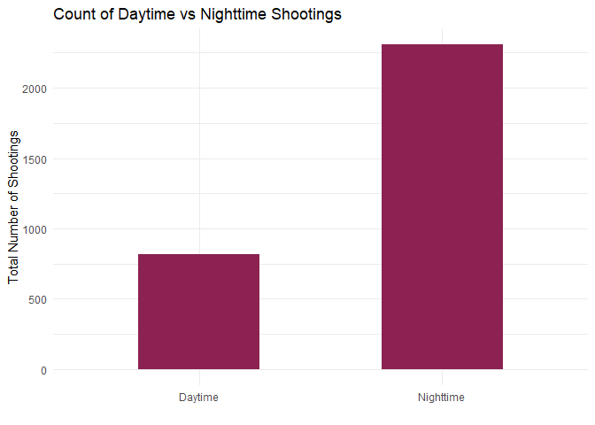<!-- -->

Yeah there definitely seems like there’s more shootings at night vs
during the day

#### TEST this

Plot of shootings per hour of the day:

``` r
plot_daylight_hour <- daylight_shooting %>% 
  ggplot(aes(x = hour)) +
  geom_bar(fill = "violetred4") +
  theme_minimal() +
  xlab("Hour of the Day") +
  ylab("Number of Shootings") +
  ggtitle("Count of Shootings per Hour of Day")

plot_daylight_hour
```

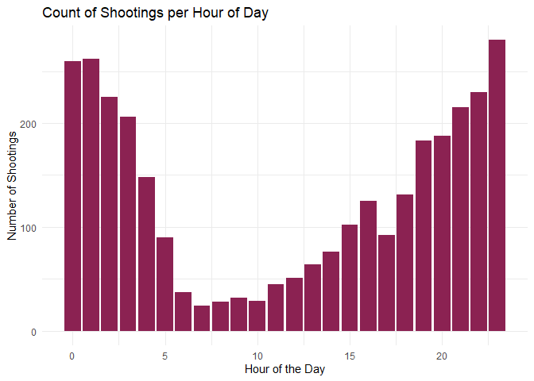<!-- -->

#### TEST also this. linear regression? logistic?

Plot of day/night shootings per month:

``` r
plot_daylight_month_light <- daylight_shooting %>%
  mutate(
    month = as.factor(month),
    month = fct_relevel(month, c("January", "February", "March", "April", "May", "June", "July", "August", "September", "October", "November", "December"))) %>%
  ggplot(aes(x = month, fill = daylight)) +
  geom_bar(position = position_dodge()) +
  theme_minimal() +
  scale_fill_manual(values = c("lightsteelblue3", "violetred4")) +
  theme(axis.text.x = element_text(angle = 90, vjust = 0.5, hjust=1)) +
  xlab("") +
  ylab("Number of Shootings") +
  ggtitle("Count of Daytime vs Nighttime Shootings, per Month")

plot_daylight_month_light
```

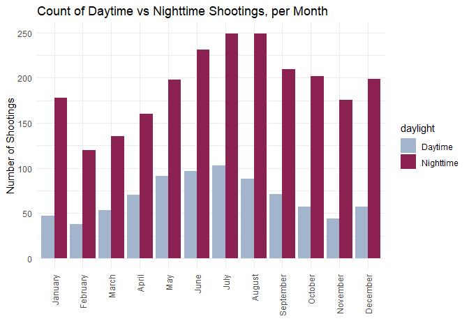<!-- -->

#### TEST this. somehow. idk. there’s something there lmao

Plot of shootings per month regardless of time:

``` r
plot_daylight_month <- daylight_shooting %>%
  mutate(
    month = as.factor(month),
    month = fct_relevel(month, c("January", "February", "March", "April", "May", "June", "July", "August", "September", "October", "November", "December"))) %>%
  ggplot(aes(x = month)) +
  geom_bar(fill = "violetred4", width = 0.7) +
  theme_minimal() +
  theme(axis.text.x = element_text(angle = 90, vjust = 0.5, hjust=1)) +
  xlab("") +
  ylab("Number of Shootings") +
  ggtitle("Count of Daytime vs Nighttime Shootings, per Month")

plot_daylight_month
```

<!-- -->

### Day of Week Analysis

Import and Setup Data:

``` r
#' Read in calendar
#'
#' @param year Relevant sheet name
#' @param range Range for the relevant month
#'
#' @returns Formatted month dates for the provided year and month
read_calendar = function(year, month, range) {
  sheet_name = as.character(year)
  range = as.character(range)
  month = as.character(month)
  
  func_cal <- readxl::read_xlsx("./Data Folder/Calendar_AllYears.xlsx", range = range, sheet = sheet_name) %>% 
    janitor::clean_names() %>% 
    rename(
      Sunday = s_1,
      Monday = m,
      Tuesday = t_3,
      Wednesday = w,
      Thursday = t_5,
      Friday = f,
      Saturday = s_7
    ) %>% 
    pivot_longer(
      Sunday:Saturday,
      names_to = "day_of_week",
      values_to = "day"
    ) %>% 
    drop_na(day) %>% 
    mutate(
      month = month,
      year = year
    )
  
  func_cal
}

#' Create a yearly calendar
#'
#' @param year Relevant sheet name
#'
#' @returns Full calendar for the provided year
create_yearly_calendar = function(year) {
  year = as.character(year)
  
  func_cal <- bind_rows(
    read_calendar(year = year, month = "January", range = "A3:G9"),
    read_calendar(year = year, month = "February", range = "I3:O9"),
    read_calendar(year = year, month = "March", range = "Q3:W9"),
    read_calendar(year = year, month = "April", range = "A12:G18"),
    read_calendar(year = year, month = "May", range = "I12:O18"),
    read_calendar(year = year, month = "June", range = "Q12:W18"),
    read_calendar(year = year, month = "July", range = "A21:G27"),
    read_calendar(year = year, month = "August", range = "I21:O27"),
    read_calendar(year = year, month = "September", range = "Q21:W27"),
    read_calendar(year = year, month = "October", range = "A30:G36"),
    read_calendar(year = year, month = "November", range = "I30:O36"),
    read_calendar(year = year, month = "December", range = "Q30:W36")
  )
}

#' Create a calendar with all provided years
#'
#' @param year_list Relevant sheet names
#'
#' @returns A calendar with all years from indicated sheets
create_full_calendar = function(year_list) {
  output <- tibble(
    day_of_week = NA,
    day = NA,
    month = NA,
    year = NA
  )
  
  for (i in 1:length(year_list)) {
    output <- bind_rows(
      output,
      create_yearly_calendar(year_list[[i]])
    )
  }
  
  output <- output %>% drop_na(day)
}

calendar <- create_full_calendar(2006:2025) %>% 
  mutate(
    day = as.numeric(day),
    year = as.numeric(year)
  )
```

Merge with Shootings:

``` r
calendar_shooting <- left_join(shooting, calendar, by = c("month", "day", "year")) %>% 
  mutate(
    weekend = case_when(
      day_of_week == "Sunday" ~ TRUE,
      day_of_week == "Saturday" ~ TRUE
    ),
    weekend = case_match(weekend,
      TRUE ~ "Weekend",
      NA ~ "Weekday"
    ),
    day_of_week = as.factor(day_of_week),
    day_of_week = fct_relevel(day_of_week, c("Sunday", "Monday", "Tuesday", "Wednesday", "Thursday", "Friday"))
  )
```

Plot of all weekdays:

``` r
plot_calendar_alldays <- calendar_shooting %>% 
  ggplot(aes(x = day_of_week)) +
  geom_bar(fill = "violetred4", width = 0.7) +
  theme_minimal() +
  theme(axis.text.x = element_text(angle = 90, vjust = 0.5, hjust=1)) +
  xlab("") +
  ylab("Total Number of Shootings") +
  ggtitle("Total number of shootings per day of the week")

plot_calendar_alldays
```

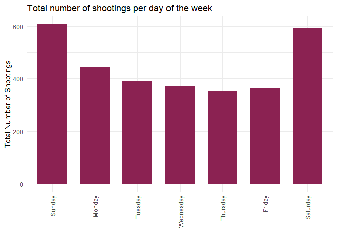<!-- -->

#### TODO weekend shootings / 2 *vs* weekday shootings / 5

#### TODO compare weekends and holidays

Plot of weekends vs week days:

``` r
plot_calendar_weekend <- calendar_shooting %>% 
  ggplot(aes(x = weekend)) +
  geom_bar(fill = "violetred4", width = 0.7) +
  theme_minimal() +
  xlab("") +
  ylab("Total number of shootings") +
  ggtitle("Total number of shootings per weekday vs weekend")

plot_calendar_weekend
```

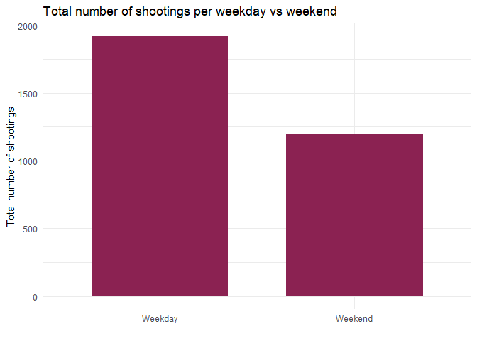<!-- -->

#### TEST all days of week individually, as opposed to binary weekend/weekday variable
